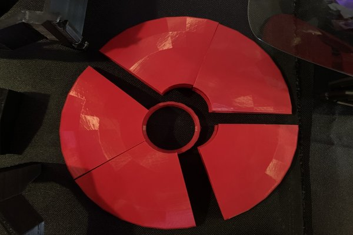

# Psi Defender

## Mk0 Prototype

## 7. Tying It All Together: Example Equations & Frequency Anchors

Below are example equations and frequency anchors you can use to help **ground** the design in measurable, scientific reality. These formulas can be tested in a lab, allowing you to refine and validate the performance of your defensive device.

---

### 7.1 Faraday / EM Shielding

To estimate electromagnetic attenuation through a conducting layer, consider the **skin depth** $\,\delta\,$ and layer thickness $ \,t\, $. An approximate formula for attenuation in decibels is:

$$
\alpha_{\text{dB}}(f) \approx 20 \log_{10}(e)\,\frac{t}{\delta},
$$

where

- $\delta = \sqrt{\frac{2\,\rho}{\omega\,\mu}}$ is the skin depth,
- $\rho$ is the electrical resistivity of the conductor,
- $\omega = 2\pi f$ is the angular frequency,
- $\mu$ is the permeability of the material,
- $t$ is the thickness of the shielding layer.

A **smaller skin depth** compared to thickness $\,t\,$ implies **stronger** shielding at frequency $\,f\,$.

---

### 7.2 Acoustic Damping

When using dense foams or composite layers to dampen mechanical or acoustic waves, a simplified **transmission loss (TL)** formula (based on the mass law) is:

$$
\text{TL (in dB)} = 10 \log_{10}\!\Bigl(\frac{1 + \frac{m\,\omega}{\sigma}}{2}\Bigr),
$$

where

- $m$ is the surface mass density of the layer,
- $\omega = 2\pi f$ is the angular frequency,
- $\sigma$ is the characteristic impedance of the medium (e.g., air).

This helps quantify how much sound intensity is reduced when passing through a barrier at a given frequency $\,f\,$.

---

### 7.3 Binaural Beat Psychoacoustics

For **binaural beats**, if the left ear receives a tone of frequency $\,f_L\,$ and the right ear $\,f_R\,$, the perceived beat frequency $\Delta f$ is:

$$
\Delta f = |\,f_L - f_R\,|.
$$

In many psychoacoustic or EEG-related contexts, $\Delta f$ is chosen to be within **1–30 Hz**, corresponding loosely to human brainwave bands (Delta, Theta, Alpha, Beta, Gamma).

---

### 7.4 Spin-Wave Disruption (Advanced / Speculative)

If external fields hypothetically target **spin waves** or **magnons** in magnetic materials, the frequency $\omega_{\text{magnon}}$ often follows:

$$
\omega_{\text{magnon}} = \gamma \Bigl(\mu_0\,H_{\text{eff}} + D\,k^2\Bigr),
$$

where

- $\gamma$ is the gyromagnetic ratio,
- $\mu_0$ is the permeability of free space,
- $H_{\text{eff}}$ is the effective magnetic field,
- $D$ is the spin-wave stiffness constant,
- $k$ is the wavevector.

By manipulating local magnetic fields (e.g., with **repulsive neodymium magnets** or mu-metal enclosures), one might shift or disrupt those resonances, theoretically protecting against spin-wave–based interference.

---

### 7.5 Practical Frequency Anchors

1. **Water’s Resonant Absorption at 2.45 GHz**  
   - Crucial for microwave-based devices (like standard microwave ovens).  
   - If directed-energy mind-affecting tech uses this band, you can measure the shielding effectiveness with a **network analyzer**.

2. **Brainwave Ranges (ELF)**  
   - Delta (0.5–4 Hz), Theta (4–8 Hz), Alpha (8–12 Hz), Beta (12–30 Hz), Gamma (30–100 Hz).  
   - These require **magnetic or quasi-static shielding** (e.g., mu-metal) rather than just a simple Faraday cage.

3. **5G & Higher Bands**  
   - 24–40 GHz (and above) for advanced 5G or millimeter waves.  
   - Materials need to handle **very short wavelengths** and **tight tolerances** for reflection, absorption, or phase cancellation.

---

### 7.6 Testing & Validation

- **Vector Network Analyzer (VNA)**: Measure scattering parameters $S_{11}, S_{21}$ for your shield layers from MHz to GHz.  
- **Acoustic Lab Measurements**: Use tone generators and decibel meters (or advanced setups) to assess transmission loss across infrasound, audible, and ultrasonic ranges.  
- **Magnetometers (Hall Effect / SQUID)**: Verify the intensity and uniformity of protective magnetic fields, especially if relying on magnet-based spin disruption.  
- **EEG Monitoring**: Check if the device affects your own brainwave patterns or blocks external “entrainment” signals by comparing user EEG with and without the shield active.

Putting all these **equations, frequency anchors, and verification steps** together gives you a **practical R&D workflow**: hypothesize your shielding or jamming approach, calculate expected performance, build prototypes, and measure in a controlled environment. Then iterate until you reach the desired defense metrics.
- **Magnetometers (Hall Effect / SQUID)**: Verify the intensity and uniformity of protective magnetic fields, especially if relying on magnet-based spin disruption.  
- **EEG Monitoring**: Check if the device affects your own brainwave patterns or blocks external “entrainment” signals by comparing user EEG with and without the shield active.

Putting all these **equations, frequency anchors, and verification steps** together gives you a **practical R&D workflow**: hypothesize your shielding or jamming approach, calculate expected performance, build prototypes, and measure in a controlled environment. Then iterate until you reach the desired defense metrics.
