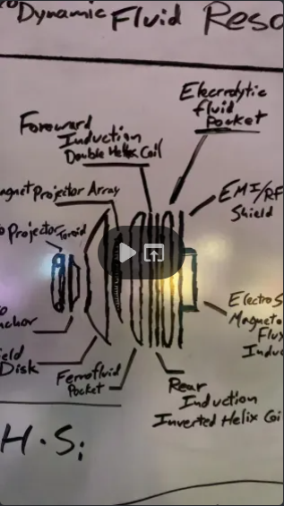

# Psi Defender Project 🛡️

**License:** [Creative Commons Zero (CC0)](https://creativecommons.org/publicdomain/zero/1.0/)  
**Purpose:** Protect raver communities, targeted individuals, and everyday citizens from oppressive sonic/psionic interference—through open research and shared DIY solutions.

[](https://www.tiktok.com/t/ZP8N7uY97/) 

---

## Table of Contents 📚

1. [Overview](#overview)  
2. [Features & Components](#features--components)  
3. [Project Structure](#project-structure)  
4. [Getting Started](#getting-started)  
5. [Contributing](#contributing)  
6. [Legal & Ethical Disclaimer](#legal--ethical-disclaimer)  
7. [Roadmap](#roadmap)  
8. [Contact & Community](#contact--community)  
9. [License](#license)

---

## Overview 🔍

The **Psi Defender** is an **open-source** initiative to create, share, and refine **wearable technology** that helps counter various forms of **sonic**, **electromagnetic**, and **psionic** attacks. Our primary audience includes:

- **Ravers** and festival-goers exposed to potentially weaponized sonic/infrasound systems.
- **Targeted Individuals** who suspect they may be subject to covert mind-control or frequency harassment.
- **Privacy and Civil Liberties Advocates** interested in counter-surveillance or EM defense.

### Why This Matters 💡

- **Increasing Reports:** Many communities report sudden anxiety, headaches, or confusion seemingly tied to directed audio/EM signals.  
- **Empowerment:** We believe everyone should have **practical tools** to protect themselves and maintain mental and emotional autonomy.  
- **Open Collaboration:** By sharing designs under CC0, we invite **global input** and **continuous improvement** of these protective strategies.

---

## Features & Components ⚙️

1. **Layered Conductive Shield**  
   - Copper/Aluminum foils, steel plating, or metamaterial inserts.  

2. **Magnetic Field Disruption**  
   - Mu-metal strips and repelling neodymium magnets to redirect low-frequency magnetic fields.  

3. **Acoustic Dampening**  
   - Dense foam, mass-loaded vinyl, or piezoelectric “noise-canceling” modules.  

4. **Active Scrambler (Optional)**  
   - Low-power RF or ultrasonic jamming coils/speakers, powered by a microcontroller.  

5. **User-Focused Design**  
   - Lightweight, breathable shells for real-world usage.  
   - Modular expansions: “snap-on” side discs, LED aesthetics for rave environments.

---

## Project Structure 🏗️

```
PsiDefender/
├── docs/
│   ├── materials_list.md        # Detailed Bill of Materials & links
│   ├── quick_start_build.md     # Basic assembly tutorial
│   ├── part7.md                 # Equations & Frequency Anchors
│   └── ...
├── hardware/
│   ├── helmet_base/             # CAD/3D-print files for main shell
│   ├── coil_winding/            # Schematics for coil arrays
│   └── ...
├── software/
│   ├── dsp_module/              # DSP scripts for noise cancellation
│   ├── sdr_monitor/             # SDR-based detection code
│   └── ...
├── experiments/
│   ├── acoustic_tests/          # Data logs & analysis
│   ├── rf_shielding_tests/      # Measurement results with VNA or SDR
│   └── ...
├── license/
│   └── CC0.txt                  # License text
└── README.md
```

---

## Getting Started 🚀

1. **Clone or Download**  
   ```bash
   git clone https://github.com/YourUsername/PsiDefender.git
   cd PsiDefender
   ```

2. **Gather Materials**  
   - Refer to [docs/materials_list.md](docs/materials_list.md) for a detailed parts list, including **common** items like aluminum foil, foam, magnets, etc.

3. **Build a Basic Shield**  
   - See [docs/quick_start_build.md](docs/quick_start_build.md) to assemble a simple, **passive** foil + foam + magnet shield.

4. **(Optional) Add Active Modules**  
   - Look under [hardware/coil_winding](hardware/coil_winding/) or [software/dsp_module](software/dsp_module/) for info on crafting your own **active noise cancellation** or **RF scrambler** setups.

5. **Test & Validate**  
   - Try the [experiments/](experiments/) folder to measure **sound attenuation** or **EM shielding**. Document your findings and share improvements.

---

## Contributing 🤝

We welcome:

- **Design Improvements**  
  - Lighter weight, new materials, improved comfort.
- **Test Data**  
  - Shielding effectiveness at various frequencies, real-life usage stories, or field tests.
- **Software Enhancements**  
  - More efficient DSP, better user interfaces, or integration with phone apps.
- **Safety & Regulatory Advice**  
  - Suggestions on how to remain compliant with local laws, plus any recommended best practices.

**Submit Pull Requests** or **open Issues** describing your changes.  
For in-depth discussions, visit our [Discussion Board](#) or reach out via email.

---

## Legal & Ethical Disclaimer ⚖️

1. **Local Laws & Regulations**  
   - Some regions heavily restrict the use of jamming or high-power transmitters.  
   - Ensure you **understand and follow** local regulations before building or operating active countermeasures.

2. **Health & Safety**  
   - Strong magnets, adhesives, and electronics require careful handling.  
   - Overexposure to loud sounds, ultrasonic blasts, or powerful EM fields **may** pose risks. Always proceed with caution.

3. **Experimental Nature**  
   - The Psi Defender is **not** a certified device and **no guarantees** are made about its efficacy or safety.  
   - By using the plans herein, you **assume all responsibility** and agree that contributors cannot be held liable.

4. **Usage Ethics**  
   - This project is meant for **defensive** applications—**not** for harassment, surveillance, or malicious interference.

---

## Roadmap 🗺️

- **Short Term**  
  - Improve passive shielding techniques and publish basic test data.  
  - Provide more “plug-and-play” modules (e.g., preconfigured coil boards).

- **Mid Term**  
  - Develop software-based “adaptive defense” that automatically detects suspicious signals.  
  - Collect crowd-sourced data from real-world testers to refine designs.

- **Long Term**  
  - Integrate emerging materials (e.g., advanced metamaterials, quantum noise sources) if they become more accessible.  
  - Encourage a **global community** of open-sourced protective gear, ensuring we stay ahead of new threats.

---

## Contact & Community 📞

- **Discord/Matrix Server**: [Invite Link](#) *(Work in progress)*  
- **Email**: [your-email@provider.com](mailto:your-email@provider.com)  
- **Website**: [https://your-website.org](https://your-website.org)

Join our **community** to share insights, help test new prototypes, and keep this project **evolving**. Every contribution—big or small—adds to the collective defense of vulnerable communities.

---

## License 📝

All contents of this repository are released under the [Creative Commons Zero (CC0)](https://creativecommons.org/publicdomain/zero/1.0/) license. This means you can **use, modify, and distribute** any part of the project **without restriction**, provided you comply with any relevant local laws. If you do improve or remix the project, please consider sharing back so others can benefit.

---

_Stay safe, stay creative, and together let’s forge a future where mind and body remain truly free._  
