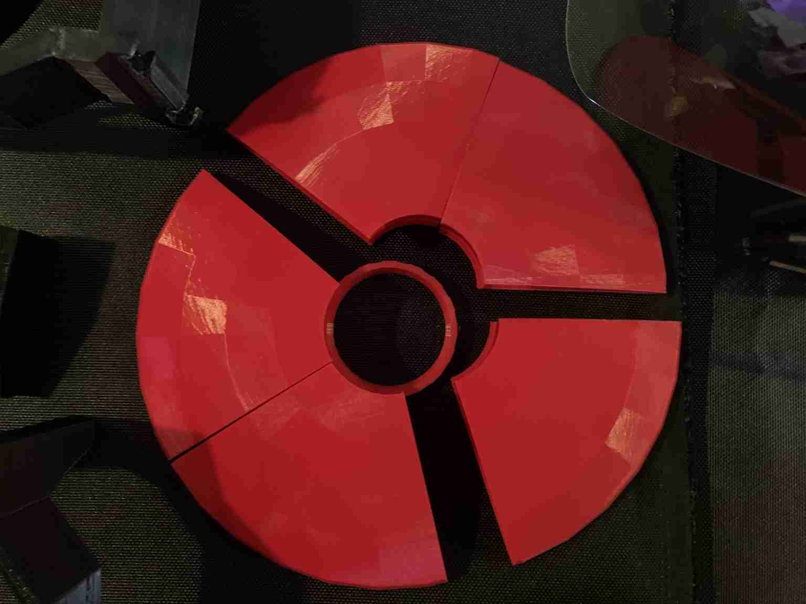

# Psi Defender

## Mk0 Prototype

Example Equations & Frequency Anchors
	1.	Faraday/EM Shielding:

where  is attenuation in dB,  is thickness, and  is skin depth.
	2.	Acoustic Damping:

(simplified mass law formula;  is surface mass density, ,  is characteristic impedance).
	3.	Binaural Beat Psychoacoustics:
\[
\Delta f = |f_L - f_R| \quad \text{(usually } 1 \text{–} 30 Hz range)},
\]
with psychoacoustic correlation to EEG frequencies:

	4.	Spin Wave Disruption (advanced and speculative):

where  is the gyromagnetic ratio,  is permeability of free space, and  is the effective magnetic field. Adjust your magnets/fields to push the system away from resonant states.
